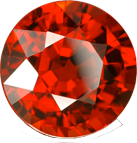
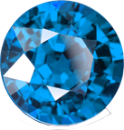
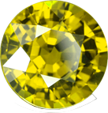
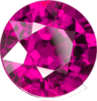
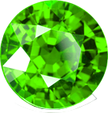

# Slingshot

This is the personal project I created for my Video Game Programming course.
There isn't a real objective other than slingshotting balls across the map to gain points by collecting coins and gems to help/hinder you. In the menu, you can change:

## Menu Description

- Slider to control number of life-lines you have (random balls)
- Slider to control number of Red gems
- Slider to control number of Blue gems
- Slider to control number of Green gems
- Slider to control number of Yellow gems
- Slider to control number of Purple gems
- Slider to control number of coins

The start button to begin gameplay.

## Item Description

- Red Gem Duplicates the ball that collides with it. 
- Blue Gem Freezes the ball in place. 
- Yellow Gem does nothing but grant 5 points. 
- Purple Gem grants the bounciness of a soccer ball. 
- Green Gem Grows the ball by half its size. 
- Coins grant 10 points 

## Controls

Use the mouse to draw back the ball by holding down the left click and dragging.
To go onto the next ball/Life-line, press SPACE.

### !!! There will be bugs and crashing !!!
